# 科豆 AI 架构图集（业务分层 + 网络部署）

> **定位**：与 [`system-overview.md`](./system-overview.md)（现状唯一入口）配套的可视化图层。
> 现状视图 · 2026-10-09 · 事实以 system-overview.md 为准。
>
> | 产物 | 文件 | 用途 |
> |---|---|---|
> | 业务分层架构 · 现代版（位图） | [`architecture-layers.png`](./architecture-layers.png) | 下载 / 贴文档 |
> | 业务分层架构 · 现代版（矢量） | [`architecture-layers.svg`](./architecture-layers.svg) | 无损缩放 / 二次编辑 |
> | 业务分层架构 · 传统版（位图） | [`architecture-layers-classic.png`](./architecture-layers-classic.png) | 下载 / 贴 PPT / 打印 |
> | 业务分层架构 · 传统版（矢量） | [`architecture-layers-classic.svg`](./architecture-layers-classic.svg) | 无损缩放 / 二次编辑 |
> | 网络部署架构 · 现代版（位图） | [`deployment-network.png`](./deployment-network.png) | 下载 / 贴文档 |
> | 网络部署架构 · 现代版（矢量） | [`deployment-network.svg`](./deployment-network.svg) | 无损缩放 / 二次编辑 |
> | 网络部署架构 · 传统版（位图） | [`deployment-network-classic.png`](./deployment-network-classic.png) | 下载 / 贴 PPT / 打印 |
> | 网络部署架构 · 传统版（矢量） | [`deployment-network-classic.svg`](./deployment-network-classic.svg) | 无损缩放 / 二次编辑 |
> | deploy-console 技术架构 · 现代版（位图） | [`deploy-console-architecture.png`](./deploy-console-architecture.png) | 下载 / 贴文档 |
> | deploy-console 技术架构 · 现代版（矢量） | [`deploy-console-architecture.svg`](./deploy-console-architecture.svg) | 无损缩放 / 二次编辑 |
> | deploy-console 技术架构 · 传统版（位图） | [`deploy-console-architecture-classic.png`](./deploy-console-architecture-classic.png) | 下载 / 贴 PPT / 打印 |
> | deploy-console 技术架构 · 传统版（矢量） | [`deploy-console-architecture-classic.svg`](./deploy-console-architecture-classic.svg) | 无损缩放 / 二次编辑 |
> | deploy-console 发布部署体系（位图） | [`deploy-console-deployment-classic.png`](./deploy-console-deployment-classic.png) | 下载 / 贴 PPT / 打印 |
> | deploy-console 发布部署体系（矢量） | [`deploy-console-deployment-classic.svg`](./deploy-console-deployment-classic.svg) | 无损缩放 / 二次编辑 |
> | env 定义与配置中心逻辑（位图） | [`deploy-console-env-config-classic.png`](./deploy-console-env-config-classic.png) | 下载 / 贴 PPT / 打印 |
> | env 定义与配置中心逻辑（矢量） | [`deploy-console-env-config-classic.svg`](./deploy-console-env-config-classic.svg) | 无损缩放 / 二次编辑 |
> | 发布流水线能力分层（位图） | [`deploy-console-pipeline-capability-classic.png`](./deploy-console-pipeline-capability-classic.png) | 下载 / 贴 PPT / 打印 |
> | 发布流水线能力分层（矢量） | [`deploy-console-pipeline-capability-classic.svg`](./deploy-console-pipeline-capability-classic.svg) | 无损缩放 / 二次编辑 |

---

## 一、业务分层架构

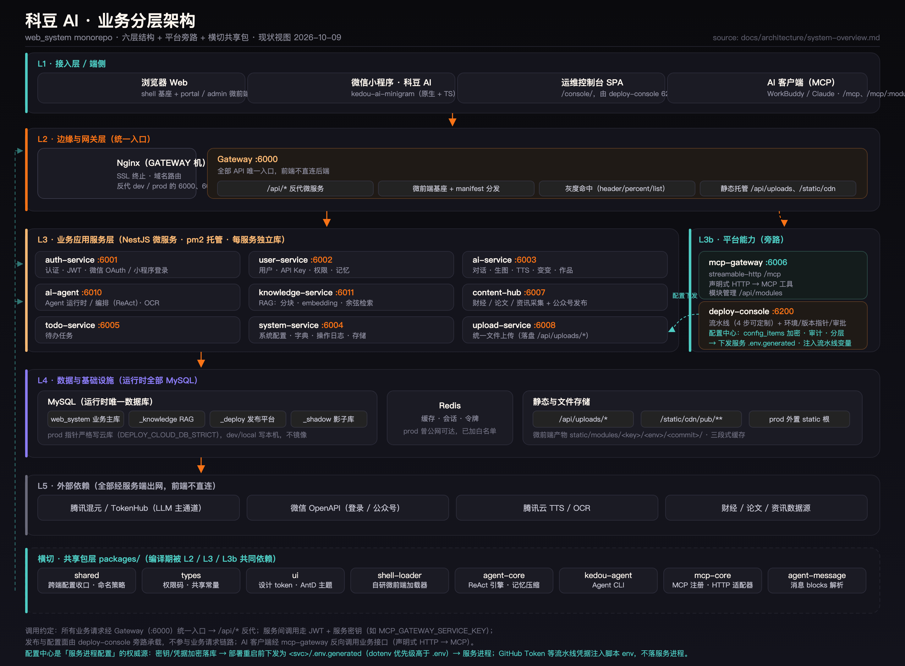

### Mermaid 文本版（可粘贴到任何支持 mermaid 的渲染器）

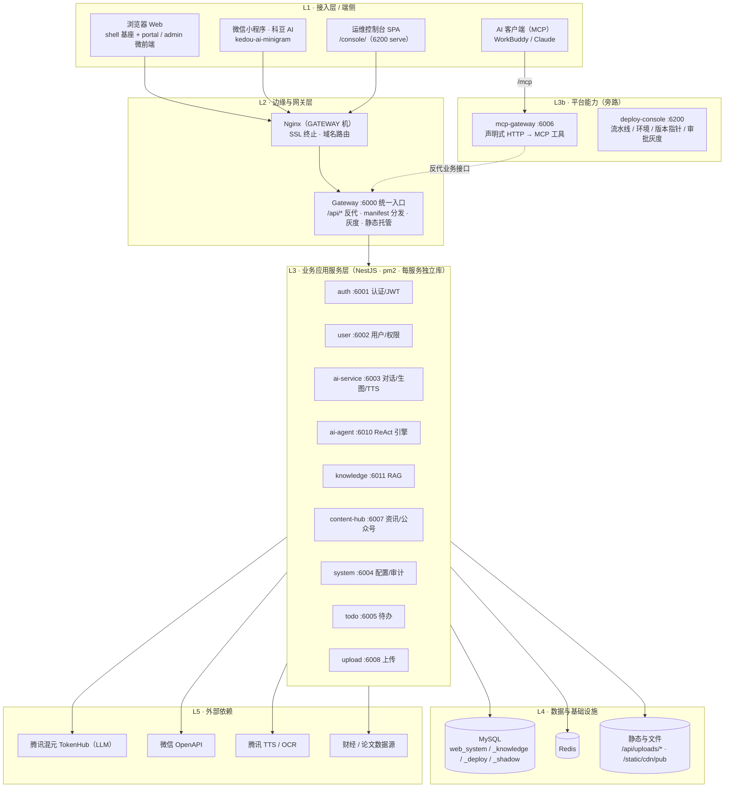

### 传统版（经典七层 + 横切栏，浅色打印友好）

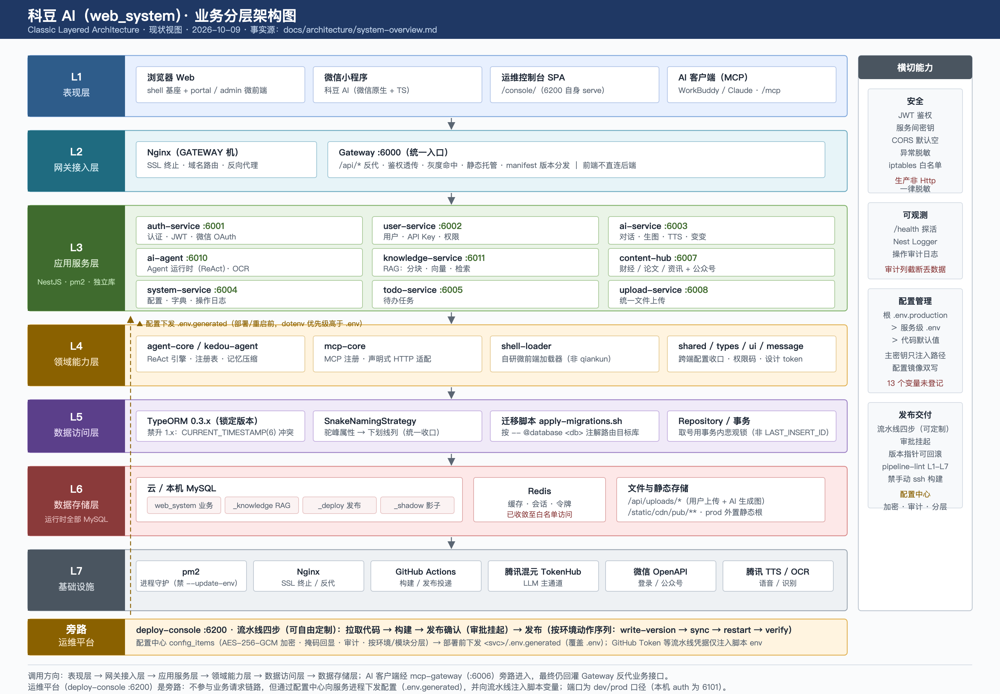

传统版按经典分层教科书式排布：**L1 表现层 → L2 网关接入层 → L3 应用服务层 → L4 领域能力层 → L5 数据访问层 → L6 数据存储层 → L7 基础设施与外部依赖**，右侧为横切能力栏（安全 / 可观测 / 配置管理 / 发布交付），内容与现代版一致，仅组织方式不同（现代版把领域能力并入横切共享包层）。

### 要点

- 所有业务请求经 **Gateway（:6000）统一入口**，前端不直连后端。
- **mcp-gateway（:6006）** 是 AI 客户端的旁路入口：声明式把业务 REST 转 MCP 工具，最终仍经 Gateway 反代回业务服务。
- **deploy-console（:6200）** 是发布/配置面旁路，不参与业务请求链路。
- 每服务独立数据库；运行时**全部 MySQL**（`docker-compose` 里的 PostgreSQL 已知失真）。

---

## 二、网络部署架构

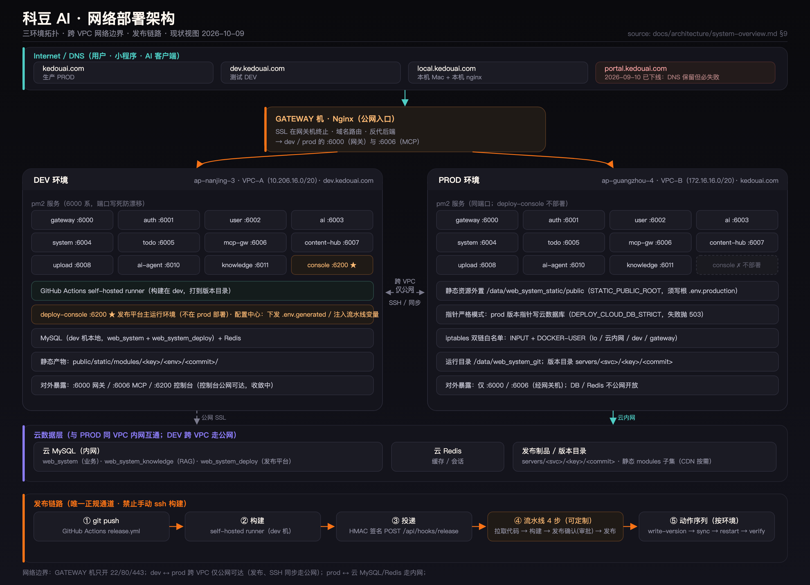

### Mermaid 文本版

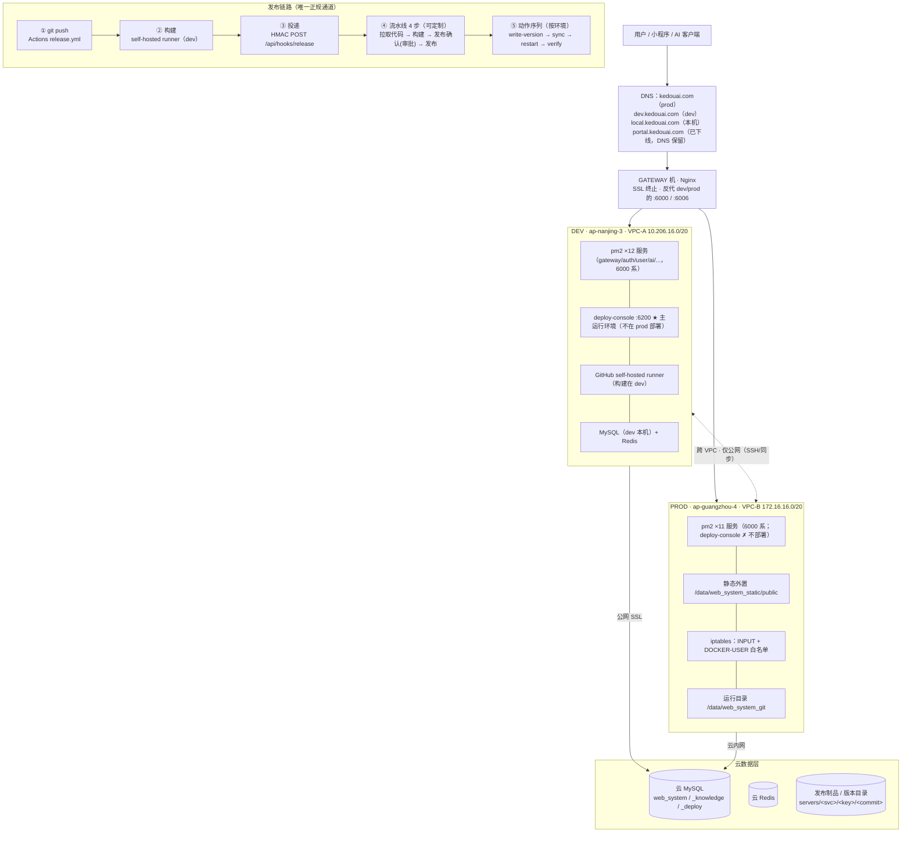

### 传统版（经典网络拓扑：云 → 防火墙 → DMZ → 内网区 → 数据区）

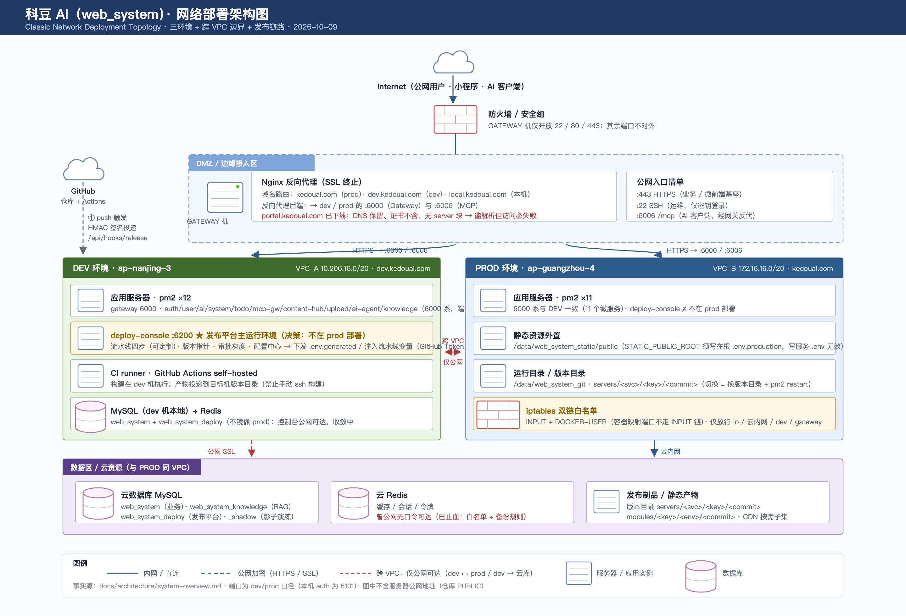

传统版按经典网络拓扑组织：**Internet（云）→ 防火墙 → DMZ 边缘接入区（Nginx 反代）→ 内网区（DEV / PROD 服务器组）→ 数据区（云数据库圆柱图标）**，含线型图例（实线 = 内网直连，虚线 = 公网加密，红虚线 = 跨 VPC 仅公网），信息与现代版一致。

### 要点

- **SSL 在 GATEWAY 机 Nginx 终止**，只反代 dev/prod 的 `:6000` 与 `:6006`；GATEWAY 机只开 22/80/443。
- **dev ↔ prod 跨 VPC，内网全不通**，只能走公网（发布、SSH 同步）；**prod ↔ 云 MySQL/Redis 走云内网**，dev 访问云库走公网 SSL。
- **deploy-console 只在 dev 部署**（决策，运维平台 + `synchronize:true` 不污染 prod 库）；prod 版本指针走严格模式写云库。
- 发布唯一正规通道 = 流水线（构建在 dev 机 runner）；`sync` 内置 workspace 包重建；禁止手动 ssh 构建。
- `portal.kedouai.com` 已下线：DNS A 记录保留但访问必失败，勿把"能解析"当"可用"。

---

## 三、deploy-console（Beehive 发布平台）技术架构

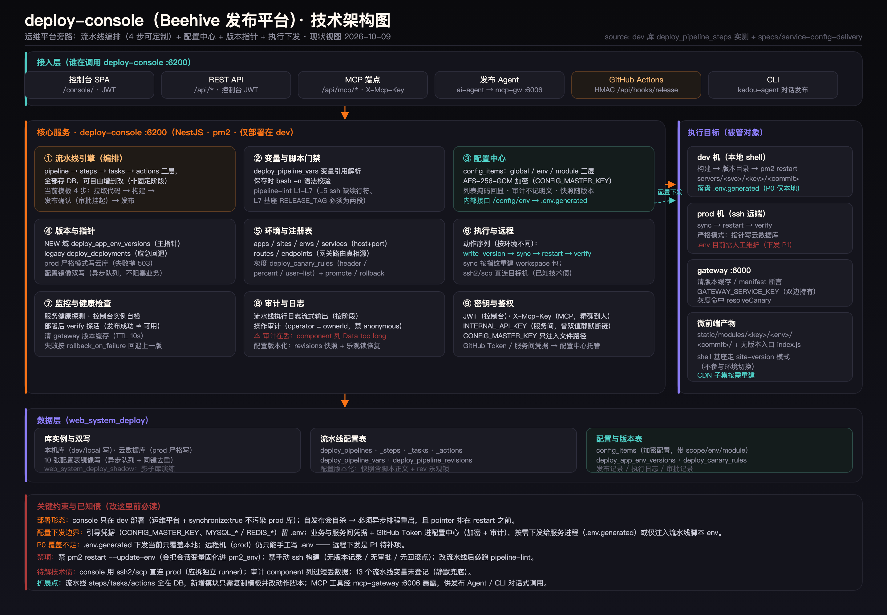

> 上图是运维平台（旁路）与被管对象关系的展开：**左侧核心服务九大模块 → 右侧执行目标（dev / prod / gateway / 产物）→ 底部数据层与关键约束**。

### 传统版（经典区块 + 标题条 + 图例，浅色打印友好）

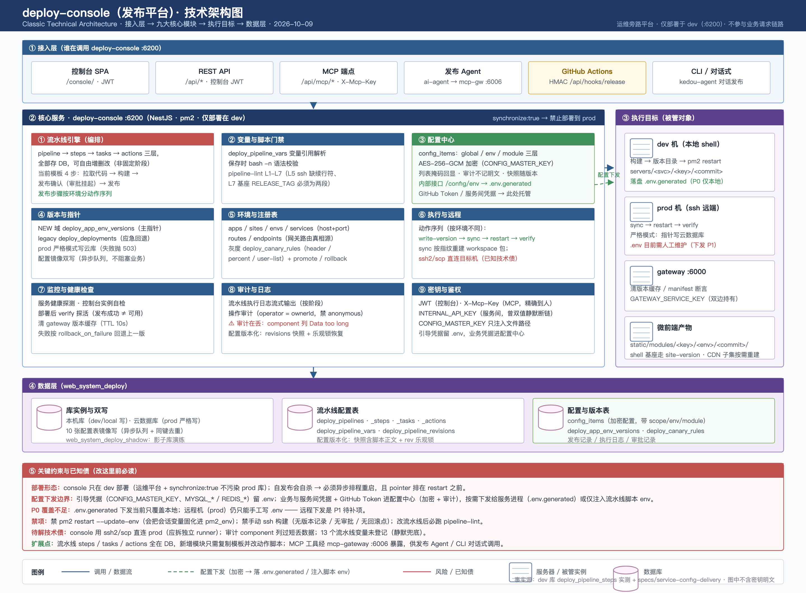

传统版按经典技术架构图排布：**① 接入层（六类调用方）→ ② 核心服务九大模块（彩色标题条区分流水线引擎/配置中心）→ ③ 执行目标（服务器/数据库图标）→ ④ 数据层 → ⑤ 关键约束与已知债**，底部含线型图例（实线 = 调用/数据流，绿虚线 = 配置下发，红线 = 风险项），内容与现代版一致。

### 3.1 流水线模型（实测 dev 库，2026-10-09）

流水线**不是固定阶段**，而是 `pipeline → steps → tasks → actions` 三层结构，全部存 DB（`web_system_deploy`），可按模块/环境自由增删改：

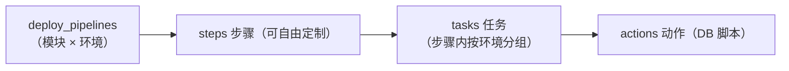

当前后端服务模板是 **4 步**（前端/后端模块同构）：

| # | 步骤 | 内容 |
|---|---|---|
| 1 | 拉取代码 | 平台托管 git 拉取（分支 + commit） |
| 2 | 构建 | 平台托管 build（按模块配置命令） |
| 3 | 发布确认 | 审批节点挂起（`awaiting-approval`），需显式 approve |
| 4 | 发布 | 按环境分任务执行动作序列：**write-version → sync（远端含 workspace 包指纹重建）→ restart（pm2）→ verify（探活 + 断言）**；local 环境无 sync |

### 3.2 配置中心（服务进程配置的权威源）

| 类别 | 例子 | 归属 |
|---|---|---|
| 引导凭据 | `CONFIG_MASTER_KEY`、`MYSQL_*` / `REDIS_*` | 留 `.env`（鸡生蛋问题） |
| 业务 / 服务间凭据 | `HY3_API_KEY`、`GATEWAY_SERVICE_KEY`、**GitHub Token** | **配置中心**（`config_items`，AES-256-GCM 加密 · 掩码回显 · 审计 · 按 global/env/module 分层） |
| 流水线局部变量 | 发布路径、目标机参数 | `deploy_pipeline_vars`（仅注入脚本 env） |

下发链路：部署/重启前由 `restart` 动作脚本 `curl` 本机控制台内部接口 `/config/env` → 落盘 `servers/<svc>/.env.generated` → dotenv 加载优先级高于 `.env` → 服务进程。

> ⚠️ **P0 覆盖不足**：该下发当前只覆盖本地；远程机（prod）仍需手工维护 `.env`，远程下发为 P1 待补项。GitHub Token 等流水线凭据走配置中心/变量注入，不落服务进程。

### 3.3 关键约束

- console **只在 dev 部署**；自发布会自杀 → 异步排程重启，pointer 必须排在 restart 前。
- 禁 `pm2 restart --update-env`；禁手动 ssh 构建；改流水线必跑 `pipeline-lint`。
- 已知债：ssh2/scp 直连 prod（应拆 runner）、审计 `component` 列过短丢数据、13 个流水线变量未登记。

---

## 四、deploy-console 发布部署体系（三环境 × 四条发布路径 × pm2 管理层）

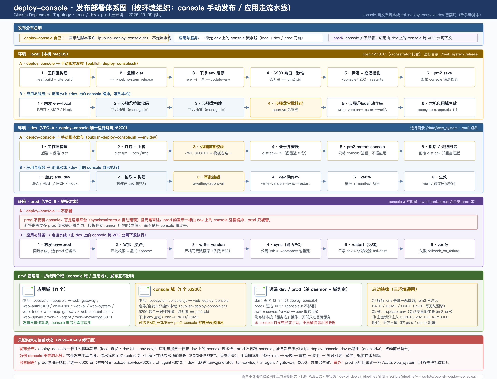

发布分布总纲（2026-10-09 修订，按环境组织）：

- **deploy-console 自己**：一律**手动脚本发布**（`publish-deploy-console.sh`，local 直发 / dev 用 `--env dev`），不走流水线；原自发布流水线 `tpl-deploy-console-dev` 已禁用（`enabled=0`，改动前已备份 `deploy_pipelines_bak_20261009`）。
- **应用与服务**：一律走 **dev 上的 console 流水线**（local / dev / prod 同链，同一条流水线按环境选任务串）。
- **prod**：console ✗ 不部署（`synchronize:true` 会污染 prod 库）；应用由 dev 上的 console 跨 VPC 公网下发执行。

按环境：

| 环境 | console | 应用/服务 |
|---|---|---|
| local（本机） | 手动脚本：工作区构建 → 复制 `~/web_system_release` → 干净 env 启停（`env -i`）→ 6200 端口一致性 → 探活 + 崩溃检测 → `pm2 save` | 流水线 env=local：4 步 → local 动作串（write-version → restart → verify，无 sync）→ 本机应用域生效 |
| dev（VPC-A） | 手动脚本 `--env dev`：工作区构建 → 打包 scp → 远端前置校验（JWT_SECRET + 模板名唯一）→ 备份替换 dist → `pm2 restart`（只动 console）→ 探活 / 失败回滚 | 流水线 env=dev：4 步 → dev 动作串（write-version → sync → restart → verify，通过后切指针） |
| prod（VPC-B） | ✗ 不部署 | 流水线 env=prod：4 步 → prod 动作串（write-version **严格写云库** → sync 跨 VPC → restart → verify）；由 dev 上的 console 执行 |

pm2 管理层（2026-10-09 起拆成两个域，发布互不影响）：

- **应用域**（本机 `ecosystem.apps.cjs`，11 个）：web-gateway(6000) / web-auth(6101) / web-user / web-ai / web-ai-agent / web-system / web-todo / web-mcp-gateway / web-content-hub / web-upload / web-knowledge(6011)。
- **console 域**（本机 `ecosystem.console.cjs`，1 个）：web-deploy-console(6200)；启停/自发布只操作本域；可选 `PM2_HOME=~/.pm2-console` 做进程表级隔离。
- **全量入口** `ecosystem.config.cjs` 只做合并（单一真相源在域文件），端口不变。
- **远端** dev/prod 保持单 daemon + 按服务名操作（发布脚本天然只动目标服务）；prod 10 个进程（console 不部署）。
- **启动铁律**：服务 `.env` 是唯一配置源；pm2 只注入 `PATH/HOME/PORT`；禁 `--update-env`；主密钥只注入 `CONFIG_MASTER_KEY_FILE` 路径。

### 已修偏差（2026-10-09，均已实测验证）

- ~~prod 注册表端口 3000 系~~ → `deploy_service_envs` prod 已统一 6000 系（并补登记 upload-service=6008 / ai-agent=6010；备份表 `_bak_20261009`）。
- ~~dev 机无 `.env.generated`~~ → 已通过下发接口落盘（ai-service 4 键 / ai-agent 3 键 / gateway 2 键，0600）并重启生效；ai-service 的 `TENCENT_*` 三件套到位，TTS 503（rNPjtC）随此闭环。
- 待办：**prod 运行目录统一为 `/data/web_system`**（现为 `/data/web_system_git`，迁移需停机窗口 + pm2 重建，待确认执行）。

### 4.1 发布流水线：平台能力 vs 流水线脚本能力

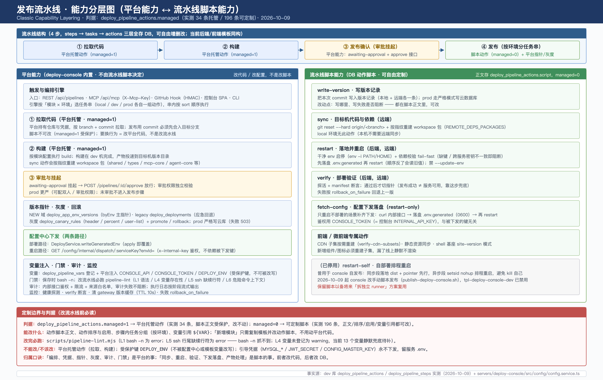

判据（实测）：`deploy_pipeline_actions.managed=1` → **平台托管动作**（34 条，脚本正文受保护）；`managed=0` → **可定制脚本**（196 条，正文/排序/启用/变量引用都可改）。

| 平台能力（改代码/改配置，不是改脚本） | 流水线脚本能力（改 DB，不是改代码） |
|---|---|
| 触发与编排引擎（REST / MCP / Hook / SPA / CLI，按模块×环境选任务串） | write-version · 写版本记录（本地+远端，prod 严格写云库） |
| ① 拉取代码（平台托管 managed=1） | sync · 目标机代码与依赖（git reset + workspace 包指纹重建；local 无） |
| ② 构建（平台托管 managed=1） | restart · 干净 env 启停 + 依赖校验 fail-fast（先落盘 .env.generated 再重启） |
| ③ 审批与挂起（awaiting-approval + approve，prod 更严） | verify · 探活 + manifest 断言（通过后切指针；失败 rollback_on_failure） |
| 版本指针 · 灰度 · 回滚（byEnv 主指针 + legacy 应急；canary rules + promote/rollback） | fetch-config · 配置下发落盘（restart-only 场景补齐，0600） |
| 配置中心下发两条路径（writeGeneratedEnv / dispatch 接口） | 前端专属动作（CDN 子集重建 / 静态同步 / shell 基座 site-version） |
| 变量注入（deploy_pipeline_vars + 受保护键 DEPLOY_ENV + 平台注入 CONSOLE_* / RELEASE_DIR 等） | （已停用）restart-self · 自部署排程重启（保留备将来拆 runner 复用） |
| 门禁与审计（bash -n、pipeline-lint L1-L7、审计/限流/来源白名单、监控断言） | —— |

归属口诀：**「编排、凭据、指针、灰度、审计、门禁」是平台的事（改代码）；「同步、重启、验证、下发落盘、产物处理」是脚本的事（改 DB）。**

---

## 五、env 定义与配置中心定义配置逻辑

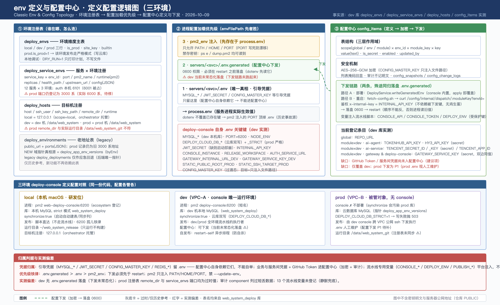

三层事实：

1. **环境注册表**：`deploy_envs`（local/dev/prod，`is_prod` 标记）→ `deploy_service_envs`（服务×环境：port / pm2_name / runtime / replicas / health_path）→ `deploy_hosts`（目标机：ssh_user / remote_dir / scope）；`deploy_environments` 是 legacy 地址表，仅历史参考。
2. **进程配置加载优先级**（`ConfigModule.envFilePath` 先出现者优先，dotenv 不覆盖已存在键）：
   `pm2_env 注入（PATH/HOME/PORT，先存在故最高）` ＞ `.env.generated（配置中心下发，0600）` ＞ `.env（唯一真相，引导凭据）`。
3. **配置中心 `config_items`**：scope（global/env/module）× env_id × module_key 三层作用域，AES-256-GCM 加密 + 掩码 + 审计；下发两条路——部署路径 `DeployService.writeGeneratedEnv`（apply 即覆盖）+ 重启路径 `fetch-config.sh`（`curl /config/internal/dispatch/:moduleKey?envId=`，`x-internal-key` 鉴权，不依赖被下发键本身）→ 落盘 `.env.generated` → restart（顺序不能反）。

**凭据归属判据**：

| 类别 | 例子 | 归属 |
|---|---|---|
| 引导凭据（配置中心自身依赖，不能自举） | `MYSQL_*` / `JWT_SECRET` / `CONFIG_MASTER_KEY` / `REDIS_*` | 服务 `.env`，永不下发 |
| 业务与服务间凭据 | `TOKENHUB_API_KEY` / `TENCENT_SECRET_*` / `GATEWAY_SERVICE_KEY` / GitHub Token（建议项） | 配置中心 `config_items`（加密+审计） |
| 流水线专用变量（平台注入） | `CONSOLE_API` / `CONSOLE_TOKEN` / `DEPLOY_ENV`（受保护键）/ `PUBLISH_*` / `RELEASE_DIR` | 仅注入动作脚本 env，不落服务进程 |

---

## 附：维护约定

- 工程事实变更（端口 / 服务 / 拓扑）→ 先改 `system-overview.md`，再同步本图。
- SVG 是源文件（手绘矢量，可直接文本编辑）；PNG 由 Chrome headless 从 SVG 以 2x 渲出：
  ```bash
  "/Applications/Google Chrome.app/Contents/MacOS/Google Chrome" --headless \
    --force-device-scale-factor=2 --window-size=1440,1060 \
    --screenshot=architecture-layers.png architecture-layers.svg
  ```
