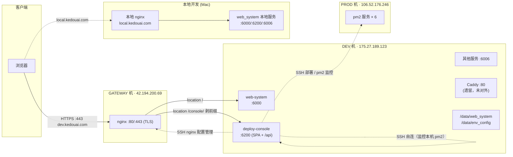

# web_system 网络架构（dev 环境流量与运维链路）

> 更新于 2026-08-15 · 配图见 `kedou-network-architecture.svg`（源文件 `kedou-network-architecture.drawio` 可导入 diagrams.net 编辑）

## 一、机器清单

| 角色 | IP | 登录用户 | 职责 |
|---|---|---|---|
| GATEWAY 机 | 42.194.200.69 | root | 公网入口，nginx :80/:443（TLS），按路径分发到 dev 机 |
| DEV 机 | 175.27.189.123 | ubuntu | web-system 主站 :6000、deploy-console :6200、其他服务 :6006，配置中心 /data/env_config |
| PROD 机 | 106.52.176.246 | root | 线上业务，pm2 服务 × 6 |
| 本地开发（Mac） | — | — | 本地 nginx（local.kedouai.com）+ 本机 web_system 各服务 |

DNS 解析：`dev.kedouai.com` → 42.194.200.69（GATEWAY 机，**不是** dev 机）

## 二、用户流量路径

```
浏览器
  ├─ https://dev.kedouai.com/*       → gateway nginx :443
  │     ├─ location /        → dev:6000  (web-system 主站 + /api)
  │     └─ location /console/ → dev:6200 (deploy-console，剥掉前缀，SSE 支持)
  │
  └─ http://local.kedouai.com/*      → 本地 nginx → 本机 :6000 / :6200 / :6006
```

gateway nginx 关键配置（`/etc/nginx/conf.d/dev.kedouai.com.conf`）：

```nginx
location /console/ {
    rewrite ^/console/(.*)$ /$1 break;          # 剥掉 /console/ 前缀
    proxy_pass http://175.27.189.123:6200;      # → dev 机 deploy-console
    proxy_http_version 1.1;
    proxy_set_header Host $host;
    proxy_set_header Connection '';
    proxy_buffering off; proxy_cache off;       # SSE 实时日志支持
    proxy_read_timeout 300s;
}
location / {
    proxy_pass http://175.27.189.123:6000;      # → dev 机 web-system 主站
}
```

要点：nginx 最长前缀匹配，`/console/api/*` 与主站 `/api/*` 互不冲突；前端 SPA 与 API 同源，无需 CORS。

## 三、运维链路（deploy-console 的 SSH 通道）

deploy-console（dev:6200）持有三台机器的 SSH 权限：

| 目标 | 方式 | 用途 |
|---|---|---|
| dev 本机（127.0.0.1 自连） | id_ed25519 → 自己的 authorized_keys | 监控本机 pm2（10 个进程） |
| PROD（106.52.176.246） | dev 的 id_ed25519 已被 prod 信任 | 部署 / 监控线上 pm2（6 个进程） |
| GATEWAY（42.194.200.69） | dev 的 id_ed25519 已被 gateway 信任 | nginx 配置管理 |

腾讯云安全组（dev 机）仅放行：**22 / 6000 / 6006 / 6200**。

## 四、架构图（Mermaid）



## 五、注意事项

1. **dev 本机 nginx 未运行**：对外入口是 gateway 的 nginx；dev 机 :80 被遗留 Caddy 占用（`redir :3000`），不影响现网
2. **本机 /etc/hosts 劫持**：Mac 上 `dev.kedouai.com → 127.0.0.1` 会劫持浏览器访问线上 dev 控制台，待处理
3. **安全风险**：`https://dev.kedouai.com/console/` 公网可达，而 deploy-console 持有三台机器 SSH 权限，建议 gateway 层加 IP 白名单（`allow x.x.x.x; deny all;`）或改走 SSH 隧道内网访问
