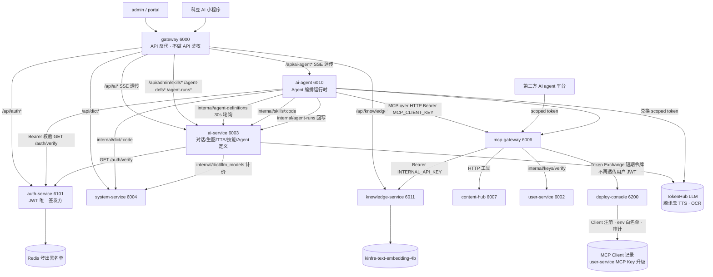
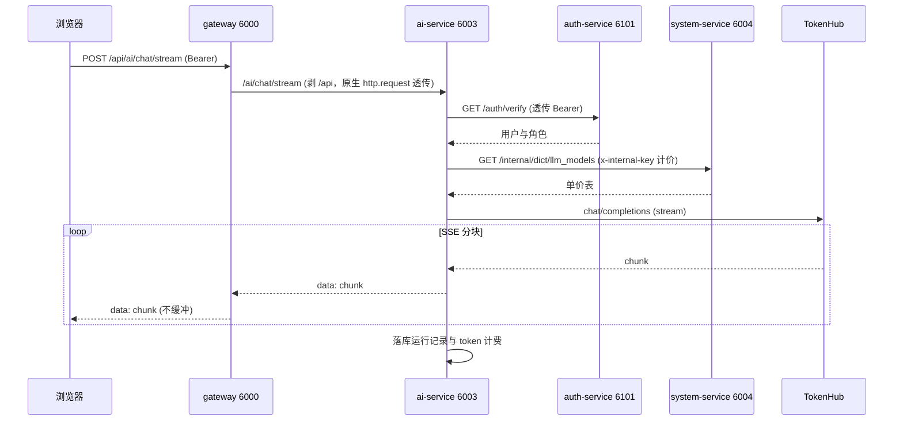
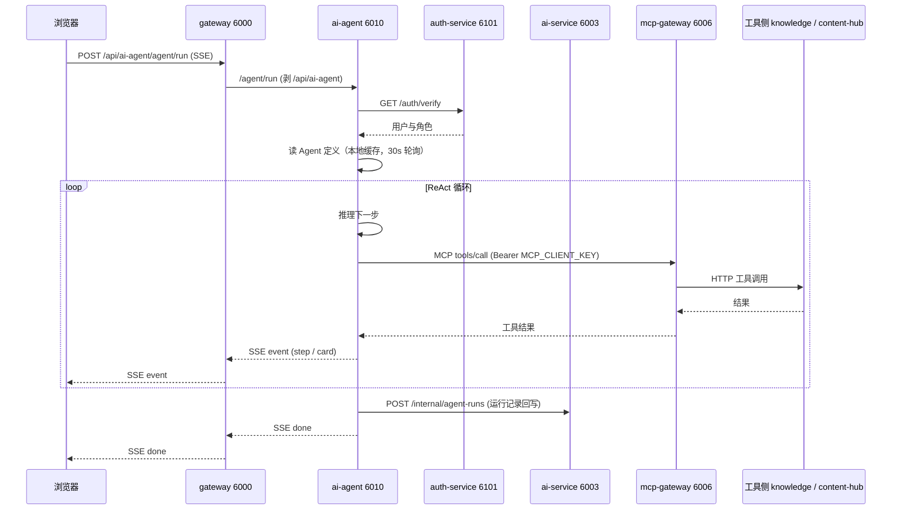
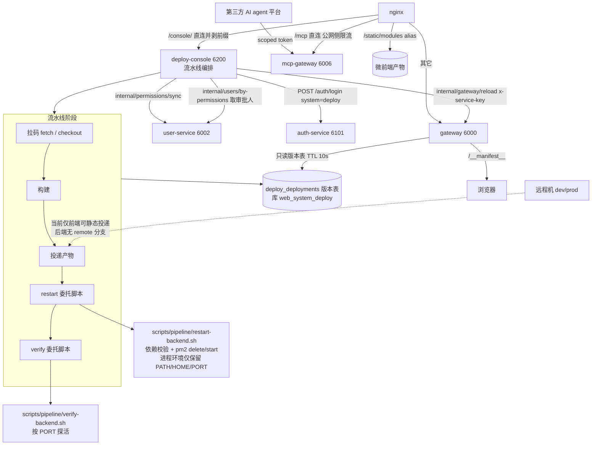
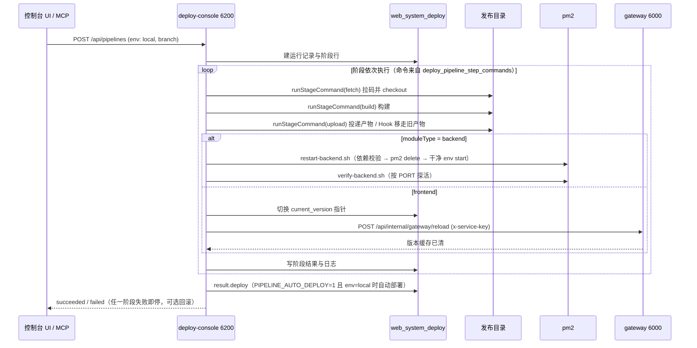

# 后端整合设计（backend-consolidation）

> 开关：CHANGELOG=off · HISTORY_NOTE=off · FAQ_KEEP=on
> 状态：**设计已定稿，尚未落码**。四个议题（A/B/C/D）彼此独立，可分期落地、独立回退。
> **全部决策项已确认**，无遗留开放问题。开工前唯一的前置门是 A6 / A2 页面部分需先过 UI 原型门。
> 事实基线全部以代码为准（`servers/gateway/src/proxy/proxy.service.ts`、`ecosystem.config.cjs`、各服务 `src/auth/auth.guard.ts`）。

## 已确认决策（2026-09-22）

| 决策 | 结论 |
|---|---|
| 本次落地范围 | **暂不改代码**，仅保留设计文档供内部评审 |
| 上传物理目录命名 | **保持 `avatars` 复数**，改 `CATEGORIES` key 与之对齐（URL 契约不变，历史磁盘直接复用） |
| 变变 AI 生成图 | **纳入统一根目录**（ai-service 改为经 upload-service 落盘），静态访问一并收口 |
| 登出/吊销容忍延迟 | **30 秒**（议题 C 采用本地验签 + 30s 吊销缓存） |
| MCP 发布能力 | 目标不止本地：**未来对外开放第三方 AI agent 平台，必须支持 dev/prod**，原「锁 local」方案作废，见 §4 重做版 |
| 第三方取结果方式 | **轮询为主**（复用既有 `GET /api/mcp/pipeline/:jobId`），webhook 作可选增强，见 §4.7 |
| prod 审批策略 | **先复用现有人工审批**（`REQUIRE_APPROVAL_ENVS`），后续再加自动策略，见 §4.8 |
| 配额 / 计费 | **需要**按 client 统计；先埋点 + 限流，口径为「流水线次数 + 构建分钟数」，见 §4.9 |
| AI 生成图历史文件 | **不迁移**；代价是 gateway 的 bianbian 特例路由长期保留作只读兜底，见 §1.6 |
| 存储目录变更怎么生效 | **重启生效**，不做热切换；页面须展示「当前生效 / 待生效」并提示重启，见 §1.2 |
| 目录选择方式 | **目录树浏览为主 + 文本输入兜底**，配 §1.5 安全约束（含新增 `storage:browse` 权限点） |
| `MCP_CLIENT_KEY` | 随 **D8** 一并退役，见 §4.11 |

## 0 事实基线

| 项 | 现状 | 证据 |
|---|---|---|
| 上传落地 | user-service 头像上传直写 `process.cwd()/uploads/avatars`，`main.ts` static serve 同目录 | `user.controller.ts:54-80`、`main.ts:38` |
| upload-service | 已有 4 个上传端点，但 controller 内 `createMulterInterceptor` **绕过** `UploadService.uploadDir`，同样写 `process.cwd()/uploads/<category>` | 服务内 `UPLOAD_DIR` 实际不生效 |
| 命名不一致 | service 的 `CATEGORIES` key 是 `avatar`（单数），controller 落盘目录用 `avatars`（复数） | 两套命名并存 |
| gateway 路由 | `/api/uploads/*` 与 `/api/upload*` → **user-service**；`/api/uploads/bianbian/*` → ai-service；`uploadServiceUrl` 读了没用 | `proxy.service.ts:48,92,102` |
| 变变图片 | 属 **AI 生成图**，落在 ai-service 本地，不是用户上传 | 迁移范围需单独判断 |
| 系统配置载体 | system-service 已有 `system_configs`（key/value）表 + `admin/settings` 读写接口（`settings:view` / `settings:edit`） | 现成可用 |
| auth 端口漂移 | `ecosystem.config.cjs` 为 6101；代码默认值多为 `http://localhost:6001`（共 7 处），deploy-console 已写 6101 | 默认值被复制 7 份 |
| 鉴权范式 | A 远程 `/auth/verify`：user / ai / ai-agent / system / todo / knowledge；B 本地验签：gateway / upload-service / deploy-console | 且 guard 逻辑复制 6 份 |
| MCP 到发布平台 | mcp-gateway 以 `DEPLOY_CONSOLE_URL`（默认 6200）+ `pass-through` 透传用户 token；目标已升级为对外开放第三方平台 | `mcp.service.ts:1052-1054`，方案见 §4 |

---

## 1 议题 A：上传收口 upload-service + 统一存储目录

### 1.1 目标

1. 全部**用户上传**写入 upload-service（6008），user-service 不再持有上传逻辑与 `uploads/` 目录。
2. 上传根目录来自**系统配置**，默认 `~/web_system/uploads`。
3. 路径解析跨平台（Windows / macOS / Linux）。
4. 系统管理页面可查看与修改；前端形态为**路径输入 + 服务端校验**（Web 端无法弹出服务端文件选择器，见 1.4）。

### 1.2 配置读取优先级

```
system_configs['storage.upload_dir']   ← 权威（system-service 持有，页面可改）
  ↓ 缺失 / 为空
env STORAGE_UPLOAD_DIR                 ← 部署注入，兜底
  ↓ 缺失
~/web_system/uploads                   ← 跨平台默认
```

- upload-service **启动时**读取配置并执行 `ensureDir` + 可写性探测；不可写则 fail-fast 并打印明确原因，**不静默回落 cwd**。
- **重启生效（已定）**：改配置后必须重启 upload-service 才切换目录，不做运行时热切换、不做 `reload` 接口。因此：
  - 页面保存时**必须明确提示**「已保存，将在 upload-service 重启后生效」，并展示「当前生效目录」与「待生效目录」两个值，避免运维以为切过去了。
  - 校验（存在性 / 可写性）在**保存前**做；但保存成功 ≠ 已生效，重启后仍可能失败（例如被其它进程删掉），所以启动时的 fail-fast 探测是最后一道防线。
  - 简化收益：省掉热切换的失败回滚逻辑与「配置是新、实际写旧」的不一致状态处理。
- 目录地址对其它服务可见：`GET /internal/storage/path` 返回**当前进程实际生效**的绝对路径（读内存值而非重读配置，避免与未生效的新配置混淆）。

### 1.3 跨平台路径解析

唯一实现放 `packages/shared/src/storage-path.ts`，禁止各服务自行拼路径。

| 输入形态 | 处理 |
|---|---|
| `~/web_system/uploads`、`~` | 展开为 `os.homedir()`（Windows 为当前用户目录） |
| 波浪号加用户名的 posix 写法 | posix 下展开对应家目录；Windows 不展开，原样进入 resolve |
| Windows 环境变量写法（如 `%USERPROFILE%` 前缀） | Windows 下按**白名单**变量名展开，不做任意变量展开 |
| Windows 盘符路径（`D:/data/uploads` 或反斜杠分隔） | 统一 resolve 为该 OS 原生分隔符，两种斜杠都接受 |
| UNC 共享路径（双反斜杠开头） | 允许，容器与非 Windows 场景给出告警提示 |

规则：

1. 处理顺序：展开家目录 → 展开环境变量（Windows 白名单）→ `path.resolve` → `path.normalize`。
2. **穿越防护**：resolve 后必须落在允许根（默认用户 home，或显式白名单）之下，否则返回 `400 UPLOAD_DIR_OUT_OF_SCOPE`。
3. 存储**该 OS 原生路径**（不强行转 posix）；DB 与日志均存归一化结果。
4. 校验项：是否存在 → 是否可写（`fs.access(W_OK)` 并实际写一个临时文件）→ 剩余空间提醒。
5. 单测按 OS 分支覆盖 darwin / linux / win32（Windows 分支可用 `path.win32` 在 macOS 上测）。

### 1.4 前端「手动选择目录」方案对比

| 方案 | 做法 | 优点 | 缺点 | 结论 |
|---|---|---|---|---|
| A 输入 + 服务端校验 | 文本框输入绝对路径 +「校验」按钮 → `POST /api/admin/settings/storage/validate`，返回 `{ok, resolvedPath, exists, writable, freeSpace, message}`；校验不通过禁止保存 | 改动小、不泄露目录结构 | 需手填路径 | **采用（与 B 并用）** |
| B 服务端目录树浏览 | `GET /api/admin/settings/storage/browse?path=` 列目录，前端树形选择 | 体验好，不用手打路径 | 暴露服务器目录结构，需安全约束（见 1.5） | **采用（已确认要做），默认开启，可用 `storage.browse_enabled` 关闭** |
| C 仅下拉预设 | 后端给出少量候选 | 最安全 | 不满足任意目录诉求 | 不采用 |

**最终形态（已定）：B 为主 + A 兜底。** 页面以目录树选择为主路径；当服务端不可用或目标路径不在允许根内（如运维想指向一块新挂的盘），回退到文本输入 + 校验。

> 浏览器拿不到服务端文件系统，**任何形态都必须由服务端列目录**，不存在纯前端方案。

### 1.5 目录浏览的安全约束（必做）

「列服务端目录」本质是把服务器文件系统结构暴露给登录用户，必须配一组硬约束，缺一不可：

| 约束 | 做法 |
|---|---|
| 权限 | 仅 `super_admin`；新增权限点 `storage:browse`，按 `packages/types` 现有权限码体系登记（参考 `database:query` 同为 super_admin 独占的写法） |
| 范围锁定 | 只能浏览**允许根**之下的路径（默认当前用户 home + 显式白名单 `STORAGE_BROWSE_ROOTS`，逗号分隔）；越界请求直接拒绝，不返回部分结果 |
| 只读目录 | **只列目录，不列文件、不返回文件内容**，避免变成文件浏览器 |
| 穿越防护 | `path` 参数经 §1.3 的解析与允许根校验后再用；拒绝含 `..` 的结果（resolve 后比对前缀） |
| 符号链接 | 不解链到允许根之外；解析后的真实路径若越界则跳过该条目 |
| 规模限制 | 单层返回条数上限（如 200）+ 递归深度上限（如 5 层）+ 单次请求超时，防止超大目录拖垮请求 |
| 审计 | 每次浏览记操作日志（`view_storage_tree`，含请求的 path），便于事后追溯 |
| 降级开关 | `storage.browse_enabled`（默认 `1`）；出现异常可一键关闭回到纯文本输入 |

> 这些约束同时也是 A 方案文本输入的防线：无论路径从哪来（树选择或手填），都在同一处做校验。

### 1.6 迁移与兼容

- **URL 契约不变**：仍是 `/api/uploads/<category>/<filename>`，前端零改动。
- gateway 切换：`/api/upload*` 与 `/api/uploads/*` 的 target 改为 `uploadServiceUrl`；bianbian 新文件随之走统一根目录。
- **变变（bianbian）收口**（已确认纳入）：ai-service 不再本地落盘，改为调 upload-service 内部接口写入统一根目录。新增 `POST /internal/uploads/store`（`x-internal-key`，接收二进制或 base64 + category + 原始文件名），返回与其它上传一致的 URL 结构。路径解析仍只存在于 upload-service，不扩散给 ai-service。
- **历史生成图不迁移**（已确认）：ai-service 本机存量文件保持原状，迁移脚本不处理 bianbian。代价是 **bianbian 指向 ai-service 的特例路由必须长期保留**，作为历史文件的只读兜底，不能随 A7 删除；否则存量 URL 会 404。该路由在文档中标注「历史遗留，仅服务旧文件」，新请求不会命中（分类优先级仍按 URL 设计，新文件实际落在统一根目录，可由 upload-service 统一出静态，走不到这条兜底）。

  > 若将来要彻底清理，需要单独一轮「bianbian 历史文件迁移」，与本议题解耦。

- 一次性迁移脚本 `scripts/migrate-uploads.mjs`：只处理 `servers/user-service/uploads/**`（头像为主），拷入新根目录对应分类子目录，输出跳过/覆盖清单，可重复执行；`users.avatar` 无需改写（URL 不变）。
- 兼容期（一个发布周期）：user-service 上传端点保留但打印 `Deprecation` 告警；兼容期后删除该端点与 `useStaticAssets`。

### 1.7 任务拆分（A）

| # | 任务 | 产出 | 依赖 |
|---|---|---|---|
| A1 | `packages/shared/src/storage-path.ts` + 单测（三 OS 分支） | 路径解析唯一实现 | — |
| A2 | system-service 新增 `GET /internal/storage/path`、`PUT /admin/settings/storage`（写前校验）、`POST /admin/settings/storage/validate`、`GET /admin/settings/storage/browse`（含 §1.5 全部安全约束）+ 权限点 `storage:browse` | 配置读写 + 校验 + 安全目录浏览 | A1 |
| A3 | upload-service 改造：删掉 controller 内的本地存储逻辑，统一走 `UploadService.getMulterOptions`；`CATEGORIES` key 改为复数（`avatars/drawing/bianbian/general`）；加 `POST /internal/uploads/store`。**目录在启动时读取、重启生效**，不做 reload 接口 | 目录真正可配，且成为唯一写入点 | A1、A2 |
| A4 | gateway 路由切换：`upload` 与 `uploads` 静态代理目标改为 upload-service | 请求真正进 upload-service | A3 |
| A5 | `scripts/migrate-uploads.mjs`（**仅 user-service 头像等用户上传**）+ 灰度验证清单 | 历史文件迁移 | A4 |
| A6 | 系统管理页面「存储配置」区块：目录树选择为主 + 文本输入兜底、校验结果展示、「当前生效 / 待生效」双值提示、**保存后提示需重启**（**需先过 UI 原型门**：原型 + 页面规格 + 人审 + 原型单独 commit + UI commit 带 `Proto: <sha>`） | UI 可配置 | A2 |
| A7 | 兼容期后删除 user-service 上传端点与 static serve；**保留** gateway 的 bianbian 特例路由作历史文件只读兜底（不删） | 收口完成 | A5 验证通过 |
| A8 | ai-service 生成图改为调 `internal/uploads/store` 落盘，去掉本地路径依赖 | 存储单点 | A3 |

**落地状态（2026-09-22）**

| 任务 | 状态 | 落点 |
|---|---|---|
| A1 | ✅（#120） | `packages/shared/src/storage-path.ts` + `.spec.ts` |
| A2 | ✅ 本轮 | `servers/system-service/src/storage/{storage.service,storage.controller,internal-storage.controller,storage.dto,storage.module}.ts`；权限点 `storage:browse`（`packages/types`，**仅 super_admin**，admin 已显式排除） |
| A3 | ✅ 本轮 | `servers/upload-service/src/storage/upload-dir.ts`、`src/upload/{upload-root,upload-root.token,upload-multer,internal-uploads.controller}.ts`、`dto/store-upload.dto.ts`；`upload.service.ts`（分类改复数、单一 Multer 实现、`storeBuffer`）、`main.ts`（静态根取进程生效值） |
| A4 | ✅ 本轮 | `servers/gateway/src/proxy/proxy.service.ts`（`uploadProxy` / `uploadStaticProxy` 目标切 upload-service、变变「先新后旧」兜底、`UPLOAD_SERVICE_URL` 默认值改 `SERVICE_URL_DEFAULTS.upload`）+ `proxy.controller.ts` + `proxy.service.spec.ts`（真 HTTP 验证，6 例） |
| A5 | ✅ 本轮（2026-09-23） | `scripts/migrate-uploads.mjs`（默认 DRY_RUN、幂等、不删源、`--apply`/`--prune` 分步）+ 内置灰度验证清单 |
| A8 | ✅ 本轮（2026-09-24） | `servers/ai-service/src/bianbian/upload-store.client.ts`（新增，multipart + `x-internal-key`）、`bianbian.service.ts::downloadAndSaveImage`（不再本地写盘）、`bianbian.module.ts`、`.env.example`（新增 `UPLOAD_SERVICE_URL`）、单测 8 例 |

**A5 说明与实测**

- 迁移目标目录**只认权威值**：`system-service` 的 `/internal/storage/path`（`system_configs['storage.upload_dir']`），
  取不到就用 `--dst`；两者都没有**直接报错退出**（不猜目录 —— 猜错等于把文件搬到没人读的地方）。
- 默认**零副作用**：`node scripts/migrate-uploads.mjs` 只扫描并出映射报告；
  执行要 `--apply`，删源要再显式 `--prune`（且要求无"目标内容不同"的冲突项）。
- 幂等：目标已存在且 size 一致（或 `--hash` 用 md5）即跳过。
- 可选 `--update-db`：把 `users.avatar` 里仍指向旧路径的引用改写为 `/api/uploads/...`。
- 本机预演实测：`servers/user-service/uploads/avatars` 有 2 个文件、统一根为 `~/web_system/uploads`、
  判定 `copy` ×2 → **确认历史头像确实不在统一根**（切 A4 后会 404，A5 确有需要；
  本机 `users.avatar` 为空，故无用户可见影响，属"孤儿文件"）。
- dev 侧：`storage.upload_dir` 指向 `/data/web_system/uploads`，历史头像本就落在那里
  → **已就地接管，dev 不需要跑迁移**；prod 是否需要在跑之前先按本脚本预演一次。

实现说明（与上文措辞的差异，均为刻意的）：

1. **允许根白名单只保留一个环境变量** `STORAGE_ALLOWED_ROOTS`（逗号分隔，追加在用户家目录之后），
   同时约束「上传目录解析」与「目录浏览范围」。§1.5 里的 `STORAGE_BROWSE_ROOTS` 不再单独引入 ——
   两个几乎同义的旋钮只会让人配错一个还以为生效了。
2. **`GET /internal/storage/path` 两侧都有，但语义必须拆开**（§1.2 末尾那句在原措辞里是混的）：
   - **system-service**：返回**权威配置值** + 它的来源（`system_configs` / `env` / `default`）；
   - **upload-service**：返回**本进程实际生效值**（启动时采纳的内存值）+ 上游来源与启动时间。
   「当前生效 / 待生效」双值就是分别取这两个（A6 页面用）。
3. **保存时允许自动创建目录**：`PUT /admin/settings/storage` 先 `mkdir -p` 再探测可写性；
   纯校验接口 `POST …/validate` 不创建、只回报「不存在」。否则「指向一块新挂的盘」这个最常见诉求无法完成。
4. **A3 与 A4 必须同批发布**：A3 让 upload-service 写到统一根（默认 `~/web_system/uploads`），
   A4 把 gateway 的 `/api/upload*` 与 `/api/uploads/*` 切到它。两者在**同一个 PR** 里，
   但**发布时也必须一起发** —— 只发 A3 或只发 A4 都会让上传链路断一段。
5. **变变图片走「先新后旧」兜底（A4 的关键细节）**：新文件在统一根（upload-service 出静态），
   历史文件只在 ai-service 本机，而两者 URL 形状相同（§1.6）。
   实现：`/api/uploads/bianbian/*` 的主目标是 upload-service，用 `selfHandleResponse: true`
   拦下上游 404 → 再问 ai-service；命中新文件时不会触碰历史服务。该兜底路由**长期保留**，
   不随 A7 删除；将来单独一轮「变变历史文件迁移」才可能退役。
5. **`upload_files.category` 数据口径不动**：磁盘分类改复数（`avatars`），落库仍是历史值 `avatar`，
   避免新旧数据割裂（磁盘目录名 ≠ DB 分类值，是有意的）。
6. 本地已把 `storage.upload_dir` 显式写为 `<home>/web_system/uploads`（走 `checkStorageDir` + `setUploadDir`，
   留审计）；`.env` 里历史的 `UPLOAD_DIR=uploads` 在启动时告警并忽略（不再读取）。

验证证据（本地）：

- 单测：system-service `src/storage` 19 例、upload-service 30 例全绿；`scripts/ci/changed-packages.sh master`
  对 `packages/types` / `system-service` / `upload-service` 三包 build+test 全过。
- 端到端（临时实例 16004 / 16008，不占用线上端口）：
  `GET /internal/storage/path` 两侧语义正确、无 key / 错 key 均 401；
  upload-service 启动日志 `上传根目录: /Users/geekwen/web_system/uploads（来源 system_service，其来源：配置表 storage.upload_dir）`；
  `POST /internal/uploads/store`（multipart 与 JSON base64 两种传法）返回 `/api/uploads/bianbian/…`，
  文件与 `upload_files` 行都落在统一根；`GET /uploads/bianbian/<file>` 200；静态服务根 = 进程生效值；
  fail-fast 两条路径（env 越界 / 目录不可创建）退出码 1 并打印明确原因。

---

## 2 议题 B：服务地址默认值收口（auth 6001 → 6101）

### 2.1 根因

`http://localhost:6001` 这份默认值在 **7 处**重复书写（gateway proxy / swagger-docs、user / ai / ai-agent / system / todo / knowledge 的 guard），属于项目铁律禁止的「跨端配置拷贝」。本机与本地发布实际是 6101（dev/prod 为 6001），`.env` 缺失即触发全站 401（2026-09-11 dev 事故同源）。另外 `deploy-console/src/environment/environment.service.ts:64` 把 auth-service 映射成 `127.0.0.1:6001`，与 console 自身 `.env.example` 的 6101 也不一致。

### 2.2 方案对比

| 方案 | 做法 | 结论 |
|---|---|---|
| A 收口到 `@web-system/shared`（推荐） | 新增 `SERVICE_URL_DEFAULTS`（以 `ecosystem.config.cjs` 为准），各服务改为 `cfg.get('AUTH_SERVICE_URL', SERVICE_URL_DEFAULTS.auth)` | 单一真相源，改一处全生效；**采纳** |
| B 必填 + fail-fast | 缺关键 URL 直接 `process.exit(1)` | 最安全但新机器起步成本高；**仅 production 启用** |
| C 只改数字 | 7 处 6001 改 6101 | 治标不治本，不采纳 |

### 2.3 落地

- B1：`packages/shared/src/services.ts` 新增 `SERVICE_URL_DEFAULTS`，注释说明 dev/prod 用 6001、本机与本地发布用 6101 的成因。
- B2：替换 7 处默认值读取，`.env.example` 同步标注。
- B3：`environment.service.ts` 的服务地址映射改为从同一常量派生。
- B4：`NODE_ENV=production` 时，缺失 `AUTH_SERVICE_URL` 等关键地址走 fail-fast（沿用既有 `JWT_SECRET` fail-fast 写法）。

---

## 3 议题 C：鉴权范式统一

### 3.1 现状问题（不止端口）

1. **两种范式并存**：6 个服务每个请求都回源一次 `/auth/verify`（多一跳 RTT，auth-service 成为强依赖单点）；3 个服务本地验签（auth 挂了仍放行到过期）。
2. **guard 复制 6 份**：同一份逻辑在每个服务的 `src/auth/auth.guard.ts` 各写一遍，是理解偏差与修漏的温床。

### 3.2 方案对比

| 方案 | 做法 | 优点 | 缺点 | 结论 |
|---|---|---|---|---|
| A 全量远程 verify | 所有服务都回源 | 即时吊销 | 每请求多一跳；auth 故障放大为全站 401 | 否 |
| B 全量本地验签 | 各服务只验 JWT | 零网络依赖、最快 | 登出黑名单失去即时性 | 单独用不够 |
| C 本地验签 + 短 TTL + 吊销缓存（**已采纳**） | access token 短 TTL；auth-service 负责签发与维护吊销（用户级 `token_version` / jti）；各服务本地验签后查**本地短缓存吊销列表**（**TTL 30s**，源在 Redis） | 无强依赖、性能好、吊销延迟可控 | 吊销最多延迟 30s | **采纳（已确认 30s）** |

### 3.3 分期

| 阶段 | 内容 | 风险 |
|---|---|---|
| C1 | 抽出 `@web-system/shared` 的统一 JWT guard（参数化 `AuthMode`），各服务改为引用；**行为完全不变**（仍是远程 verify） | 低，纯结构收敛，可单服务灰度 | 🟡 **灰度中**：`packages/shared/src/auth/unified-auth.ts` + `todo-service` 首个接入（其余 7 个服务后续逐个迁） |
| C2 | guard 增加 `local` 模式（本地验签 + 30s 吊销缓存），用 `AUTH_MODE=local|verify` 双轨运行，逐服务切换 | 中，需灰度 + 对照验证 |
| C3 | 全量切 `local`，`/auth/verify` 降级为兼容端点（保留一个发布周期后下线） | 中，取决于前端刷新令牌改造 |

### 3.4 与议题 D 的协同

MCP 客户端 token 与用户 token 共用同一吊销机制（30s 缓存），因此**对外开放的 MCP 凭据被吊销后，最多 30s 内失效** —— 这是 §4 敢把 dev/prod 开放给第三方平台的前提之一。

---

## 4 议题 D：MCP 对外开放发布能力（第三方 AI agent 平台 + dev/prod）

### 4.1 目标变更（重要）

原假设是「本地开发自用」，故曾提出把 MCP 的发布能力锁死在 `env=local`。新目标是**对外开放给第三方 AI agent 平台，且必须能部署到 dev/prod**，威胁模型从「自己误操作」升级为「外部主体的凭证泄漏 / 越权 / 刷流量」，**锁环境的方案作废**（仅作为默认最小权限保留）。

### 4.2 现状与风险（已核实修正）

准确链路是两段，不能混为一谈：

| 段 | 实现 | 证据 |
|---|---|---|
| mcp-gateway → deploy-console | `seedDeployModule` 配 `authType='pass-through'`，把**调用方凭据原样转发**给 `/api/mcp/*` | `mcp.service.ts:1052-1054`、`passThroughToken: token`（`:1038,1046`） |
| deploy-console 侧校验 | `McpController` 标 `@Public()` + `@UseGuards(McpKeyGuard)`，校验的是** MCP Key（每用户 API Key → ownerId）**，不是用户 JWT；操作人一律取 `req.mcpOperator` | `mcp.controller.ts:23-32,45-47` |

> 修正：此前表述为「透传用户 JWT」不准确 —— 透传的是**客户端凭据**，且 deploy-console 端用的是 Key 校验而非 JWT 验签。

对外开放时仍然存在的问题（这四点才是真正的缺口）：

1. **无客户端隔离**：`MCP_CLIENT_KEY` 是全局共享的一把；即使是用户 API Key，也是「人」的粒度而非「第三方平台」的粒度，无法按平台做限额、审计与单独吊销。
2. **无环境/动作收敛**：`env` 由请求体直接给，现在只有 prod 要 `confirm=true` 这一层薄保护（`mcp.controller.ts:55-57`），没有 per-client 白名单。
3. **无结果归属校验**：`GET /api/mcp/pipeline/:jobId` 任何人拿到 jobId 都能查（未见 owner 隔离），第三方可以查到别人的流水线。
4. **无限额与配额**：无速率/并发约束，也无按客户端的度量聚合。

同时，**已有能力应该复用而不是重造**：

- 轮询接口已存在且是为一等公民设计的（`GET /api/mcp/pipeline/:jobId` 返回 `status/stage/progress/logs`，注释明确「供 MCP 工具直接映射」）。
- 审批已存在：`REQUIRE_APPROVAL_ENVS`（默认只要求 prod，页面可维护）+ approval 模块支持「挂起 → 批准后从该节点继续」。
- 通知已存在：`NOTIFY_WEBHOOK_URL` / `NOTIFY_WECOM_URL` 广播式推送 + `notification_logs` 送达记录（5s 超时、尽力而为不阻塞）。
- 度量已存在：MetricsModule（成功率 / 时长 / 失败阶段分布）。

### 4.3 方案对比

| 方案 | 做法 | 评价 |
|---|---|---|
| S1 锁死 local（原 D1） | MCP 发布能力仅允许 `env=local` | **否决**：不满足第三方与 dev/prod 目标，只配当默认最小权限 |
| S2 pass-through + 人工审批 | 保留透传用户 JWT，只对 prod 加审批 | **否决**：凭证面不收敛、无法审计与限额，治标 |
| **S3 Client 注册 + 三层授权 + Token Exchange + 限额审计（推荐）** | 见 4.3~4.6 | 满足对外开放 + dev/prod，代价是引入 Client 注册模型与令牌兑换端点 |

### 4.4 三层授权模型（核心）

一次发布授权 = **身份（client）× 环境（env）× 动作（action）**。

**身份层 —— MCP Client 注册**（复用并升级 user-service 已有的 MCP API Key 体系）：

| 字段 | 说明 |
|---|---|
| `clientId` / hashed secret | 第三方平台的长期凭据，仅用于兑换短期令牌 |
| `allowedEnvs` | 允许发布的环境白名单（如 `local`、`local,dev`） |
| `allowedScopes` | 允许的动作（见下） |
| `rateLimit` / `concurrency` | 速率与并发上限 |
| `requireApproval` | 是否必须走审批 |
| `expiresAt` / `status` | 支持到期与吊销（与议题 C 的 30s 吊销缓存联动） |

内置 `local-dev` client：`allowedEnvs=local`、免审批、高限额 —— 保留今天「一句话发布」的开发体验。

**环境层 —— per-client 白名单**：

| 环境 | 默认策略 |
|---|---|
| local | 默认允许，免审批 |
| dev | 需 client 显式授权；可选自动放行（仍受限额约束） |
| prod | 必须显式授权 + **强制审批**（人或自动策略）+ 灰度投放 |

**动作层 —— scope 细化**：`pipeline:read` / `pipeline:create` / `deploy:rollback` / `artifact:promote`；回滚与生产提升为独立 scope，默认不授予。

### 4.5 凭证：Token Exchange（必做）

取消 `pass-through`，改为：

1. 第三方 client 用长期 secret 向 deploy-console 兑换短期令牌。
2. 令牌参数：`aud=deploy-console`、`scope=pipeline:create@env:dev`、`TTL 5min`、绑定 `clientId`。
3. 用户 JWT 不再出现在 MCP 链路上；deploy-console 可识别 `actor_type=mcp` 与 `client_id`。
4. 令牌即时可撤，撤销生效延迟 ≤ 30s（议题 C 机制）。

### 4.6 爆炸半径控制

- **并发**：单个 client 同时最多 N 条流水线（默认 1），避免第三方并发刷爆构建机。
- **速率**：每小时 / 每天触发上限，超限返回明确错误码。
- **审批**：prod 必走既有 approval；审批期间返回 `pending` + `pipelineRunId`，第三方经回调或轮询取结果。
- **dry_run**：新增演练模式（构建但不投递/不重启），供第三方 agent 自测，不产生副作用。
- **审计**：MCP 触发的每次流水线记录 `actor_type / actor_id / source_ip / user-agent`，进入既有操作日志。

### 4.7 结果获取：轮询 vs Webhook（已定：轮询为主）

先给结论：**好做的是轮询，而对 AI agent 平台这个对象来说，轮询同时也是更科学的那个** —— MVP 上两者重合，不用纠结。

| 维度 | 轮询 `GET /api/mcp/pipeline/:jobId` | 回调 Webhook |
|---|---|---|
| 现状成本 | **几乎为零**，接口已存在且就是为 MCP 工具映射设计的 | 现有 `notification.service.ts` 是**单一 URL 全局广播**（运维告警用），要当第三方可靠回调必须重写：per-client URL + HMAC 签名 + 退避重试 + 幂等键 |
| 契合度 | 契合 MCP 的请求-响应模型：agent 现在就要答案 | 要求第三方平台暴露公网入口并常驻在线；Coze/Dify 一类平台未必支持收回调 |
| 实时性 | 取决于间隔（可用 `suggestedPollIntervalMs` 自适应） | 实时，无空轮询 |
| 无效请求 | 有（长流水线期间会放大） | 无 |
| 失败语义 | 简单：查不到就是查不到 | 复杂：丢消息需重放，要做送达确认与重试账本 |
| 适合对象 | AI agent 平台、交互式调用 | CI/CD 编排类集成、事件总线式集成 |

**采用方案**：

1. MVP 用轮询。MCP 工具 `deploy_status(jobId)` 返回 `status / stage / progress / logs`，并附带 `suggestedPollIntervalMs`（按阶段自适应：构建期 3s、等待审批期 30s）。
2. **必须补的缺口**：给 `GET /api/mcp/pipeline/:jobId` 加 owner/client 归属校验（现状是拿 jobId 就能查，见 4.2 缺口 3）。
3. Webhook 留作 D3 可选增强，届时在**现有通知服务**上扩展而不是另起炉灶：per-client `callbackUrl` + secret、HMAC 签名、`X-Idempotency-Key = jobId:status`、最多 N 次退避重试，并强制 SSRF 防护（仅 https、禁止内网 IP 与回环地址、DNS 重解析防护）。

### 4.8 审批策略（已定：先复用现有人工审批）

现有条件已经够用，**不需要新写审批机制**：

- `REQUIRE_APPROVAL_ENVS`（默认只要求 prod，页面可维护）+ approval 模块支持「挂起 → 批准后从该节点继续」。
- MCP 触发走的是同一个 `PipelineService.submit`，因此天然经过同一审批门禁；额外保留 prod 需 `confirm=true` 的薄约束。

落地要点：

| 项 | 做法 |
|---|---|
| 触发 | MCP 与 UI 共用同一审批门，不搞两套规则 |
| 挂起态 | 轮询返回 `status=waiting_approval` + `approvalId`，agent 据此提示「去控制台审批」 |
| 归属展示 | 挂起记录的操作人是 `req.mcpOperator`（API Key 的 ownerId），控制台应在审批列表标注「来源：MCP / client xx」，避免审批人不认识操作人 |
| 后续自动策略 | 在 approval 判定处预留策略入口（P1 不动）：如「变更行数 < N 且测试通过 → 自动放行」。届时再加，现在不改结构 |

### 4.9 配额与度量（已定：需要 per-client 统计）

先统计、后计费 —— 第一步只做埋点与限流，不引入计费系统。

| 层 | 做法 |
|---|---|
| 埋点 | 流水线记录增加 `source`（`console` / `mcp`）与 `clientId` 字段，已有 `deploy_pipelines` 表扩展即可 |
| 度量聚合 | 复用 MetricsModule，按 client 出：触发次数、成功率、平均/分位时长、构建分钟数、并发峰值 |
| 执行限额 | 每 client 的 `rateLimit`（每小时 / 每天）与 `concurrency`（默认 1）；超限返回明确错误码 `429 CLIENT_QUOTA_EXCEEDED` / `409 CONCURRENCY_EXCEEDED`，不要含糊地降级 |
| 计费口径（建议） | **流水线次数 + 构建分钟数**两个维度，与现有度量字段同源，将来接计费不用重新埋点 |
| 暴露方式 | 控制台 Client 详情页看自己的用量；后续如需对账再出只读 API |

### 4.10 网络拓扑

- 对外：nginx `/mcp` 直连 mcp-gateway 6006（现状），公网侧加限流，可选 mTLS。
- 对内：mcp-gateway → deploy-console 走内网，不跨公网。
- 第三方平台**只持有 per-client scoped token**，拿不到任何基础设施凭据（SSH key / INTERNAL_API_KEY）。

### 4.11 分期

| # | 任务 | 产出 | 依赖 |
|---|---|---|---|
| D0 | **补归属校验**：`GET /api/mcp/pipeline/:jobId` 加 owner/client 归属（当前拿 jobId 就能查别人的流水线，是既有缺陷，应先单独修） | 结果只对持有者可见 | 无（可最先做） |
| D1 | MCP Client 注册模型（`clientId`/secret、`allowedEnvs`、`allowedScopes`、`rateLimit`、`concurrency`、`expiresAt`/`status`）+ 流水线记录增加 `source` 与 `clientId` | 权限与埋点按 client 收敛 | 复用 user-service 现有 MCP Key 表扩展 |
| D2 | per-client 环境白名单校验 + 审计字段（`actor_type`/`actor_id`/IP/UA） | 越权被拦、可追溯 | D1 |
| D3 | 轮询增强：`suggestedPollIntervalMs` 自适应 + `waiting_approval` 与 `approvalId` 透出 + 审批列表标注 MCP 来源 | 第三方可靠取到结果与审批状态 | D0、D2 |
| D4 | 度量与限额：按 client 聚合（次数/成功率/时长/构建分钟/并发峰值）+ 限流与并发闸门，返回明确错误码 | 可观测 + 可配额 | D1 |
| D5 | Token Exchange（`aud=deploy-console`、scope 含 env、TTL 5min、绑定 clientId），`pass-through` 下线 | 客户端凭据不再全链路透传 | D1、议题 C 的 30s 吊销 |
| D6 | `dry_run` 演练模式 + 第三方接入文档 | 可对外开放 | D4、D5 |
| D7 | Webhook 增强（可选）：在现有通知服务上做 per-client `callbackUrl` + HMAC + 重试 + SSRF 防护 | 事件驱动集成 | D6 之后按需 |
| D8 | 遗留全局 `MCP_CLIENT_KEY` 退役 | 鉴权单轨 | D6 |

### 4.12 已确认事项（原待确认项）

| # | 事项 | 结论 |
|---|---|---|
| 1 | 第三方平台取结果用 webhook 还是轮询 | **轮询为主**（详见 4.7）；webhook 作可选增强排在 D7 |
| 2 | prod 审批策略 | **先复用现有人工审批**（`REQUIRE_APPROVAL_ENVS`），后续再加自动策略，预留策略入口 |
| 3 | 是否需要按 client 的配额/计费统计 | **需要**；先做埋点与限流，计费口径为「流水线次数 + 构建分钟数」（详见 4.9） |

---

## 5 分期总览

| 优先级 | 任务 | 是否过 UI 门 |
|---|---|---|
| P0 | B（服务地址收口，低风险、立刻见效） | 否 |
| P1 | C1（guard 抽出，行为不变） | 否 |
| P1 | A1 / A3（路径工具 + upload-service 收为核心写入点） | 否 |
| P1 | D0（补 `pipeline/:jobId` 归属校验，既有缺陷，可最先做） | 否 |
| P1 | D1 / D2（MCP Client 注册模型 + env 白名单 + 审计埋点） | 否 |
| P2 | D3（轮询增强 + 审批态透出 + 来源标注） | 否 |
| P2 | A4 / A5 / A8（gateway 切路由、迁移脚本、ai-service 落盘改造） | 否 |
| P2 | A6（系统管理页面存储配置） | **是**（原型 + 规格 + 人审） |
| P3 | C2 / C3（鉴权切体，30s 吊销缓存） | 否 |
| P3 | D4 / D5（度量与限额、Token Exchange 下线透传） | 否 |
| P3 | D6（dry_run + 接入文档） | 否 |
| P4 | A7（删除兼容端点与特例路由）、D7 / D8（可选 webhook、`MCP_CLIENT_KEY` 退役） | D8 涉及 Client 管理页时需走 UI 门 |

> 依赖关系：D2 依赖 C 的吊销机制（至少要能在 30s 内让一把令牌失效）；A8 依赖 A3 的 `internal/uploads/store`。

> 进度：**B、D0、A1、A2、A3、A4、A5、A8 已完成**（A8 见 PR #148；dev 已验证，见 `docs/reviews/a8-ai-image-store-release.md`）；
> **C1 灰度中**（shared 助手已落地，todo-service 首个接入，其余 7 服务待迁）；D1 / D2 待做；A6（需过 UI 门）与 A7（依赖 A5 验证）在后。
>
> **A8 上 prod 的前置**：prod 的 upload-service **未运行且端口未登记** —— 需先起服务、配 `UPLOAD_SERVICE_URL` 与 `INTERNAL_API_KEY`（与 ai-service 同值），否则 prod 新生成图会走降级（存 MaaS 远端 URL，功能可用但不符合收口目标）。
>
> C1 的收敛方式（与"直接把 guard 塞进共享包"的区别）：
> - 共享包**只出纯函数助手**（`verifyRemoteToken` / `resolveAuthServiceUrl` / `extractBearerToken`），
>   **不抛 `UnauthorizedException`、不注入 `Reflector`** —— 避免 pnpm 隔离下 `@nestjs/common` /
>   `@nestjs/core` 双实例导致 HTTP 异常退化成 500、DI token 不匹配（与既有
>   `auth/permission.guard.ts` 同约定）。
> - 各服务保留一层**薄 guard**负责抛 401 与文案 → **行为完全不变**。
> - 两处刻意改进（只在异常配置下触发）：`AUTH_SERVICE_URL` **空串回落默认值**（旧写法会
>   `fetch('')` 被误报成"认证服务不可用"，2026-09-11 dev 事故同源）、远程校验加 **8s 超时**。

> ⚠️ A3 与 A4 有**发布耦合**：两者已在同一 PR，但发布时也必须一起发（见 §1.7 落地状态说明 4）。

---

## 6 决策一览（无遗留开放项）

| # | 事项 | 状态 |
|---|---|---|
| 1 | 物理目录命名（复数 `avatars`，改 `CATEGORIES` key 对齐） | **已确认** |
| 2 | 变变 AI 生成图纳入统一根目录 | **已确认纳入** |
| 3 | 议题 C 吊销延迟容忍窗口 | **已确认 30s** |
| 4 | 议题 D 是否锁 local | **已作废**，改为对外开放模型（§4） |
| 5 | 运行时热切换 vs 重启生效 | **已确认：重启生效**（§1.2） |
| 6 | 是否需要目录树浏览（B 方案） | **已确认：要，且作为主路径**（§1.4、§1.5） |
| 7 | 第三方平台取结果：回调 webhook vs 轮询 | **已确认：轮询为主**（§4.7） |
| 8 | 是否需要按 client 的配额/计费统计 | **已确认：需要**（§4.9） |
| 9 | prod 审批：复用既有 approval vs 新增自动策略引擎 | **已确认：先复用人工审批，自动策略后置**（§4.8） |
| 10 | AI 生成图历史文件是否迁移 | **已确认：不迁移**，bianbian 特例路由长期保留作只读兜底（§1.6） |
| 11 | `MCP_CLIENT_KEY` 退役节奏 | **已确认：随 D8 一并退役**（§4.11） |
| 12 | 运行时热切换 vs 重启生效 | **已确认：重启生效**（§1.2） |
| 13 | 是否需要目录树浏览（B 方案） | **已确认：要**，作为主路径、文本输入兜底，配 §1.5 安全约束 |

---

## 附录 A · AI 链路

### A.1 架构图



### A.2 时序图 —— 对话 SSE



### A.3 时序图 —— Agent 运行（ReAct + MCP）



---

## 附录 B · 发布链路

### B.1 架构图



### B.2 时序图 —— 一次流水线（env=local）



> 已知限制：后端阶段只能重启 **console 所在机** 的 pm2；远程发布能力在 `specs/pipeline-node-model/design.md` 的 P0/P1 计划中。

---

## 常见问题

**Q：为什么不直接让前端直连 upload-service？**
所有 API 一律经 gateway（项目铁律），否则鉴权与版本治理会分叉。

**Q：多台机器能否共享上传目录？**
当前是本地磁盘。若将来要跨机，需换对象存储或 NFS；本设计把路径解析与 IO 集中在 upload-service，届时只需改这一个点。

**Q：议题 C 会不会改坏线上登录？**
C1 阶段行为完全不变（只做代码收敛），可单服务灰度；真正的语义变更在 C2，且由 `AUTH_MODE` 开关双轨控制。

**Q：第三方 AI agent 平台具体怎么接？（目标形态）**
注册一个 MCP Client → 拿到 `clientId`/secret 与 `allowedEnvs` → 调 token 兑换端点拿 5min scoped token → 用它触发流水线拿到 `jobId` → 轮询 `GET /api/mcp/pipeline/:jobId`（响应里带 `suggestedPollIntervalMs`，照它睡就不用自己拍间隔）。prod 默认进人工审批，此时状态是 `waiting_approval` 并带 `approvalId`，审批通过后自动继续。凭据可按 client 单独吊销，30s 内生效。

**Q：为什么不能只加审批、保留透传用户 JWT？**
因为吐给第三方的是**用户身份**：无法按环境/模块/动作收敛权限，也无法与「某个第三方」绑定做限额、吊销和审计。审批只能挡住误操作，挡不住凭证滥用。
